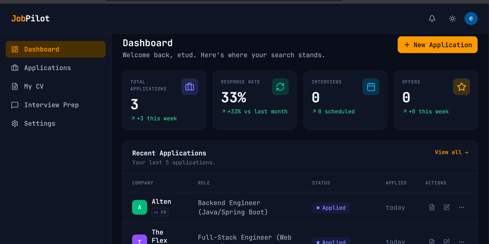
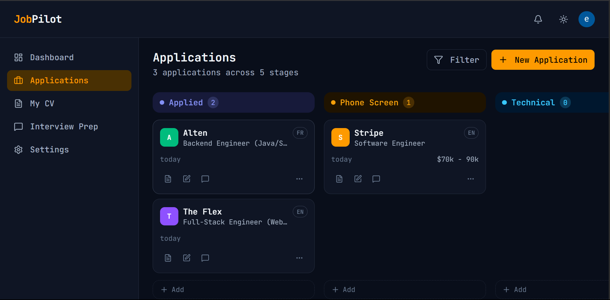
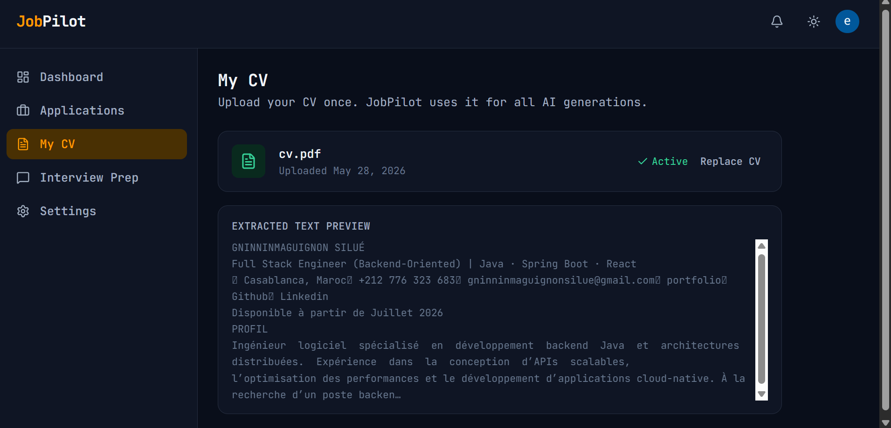
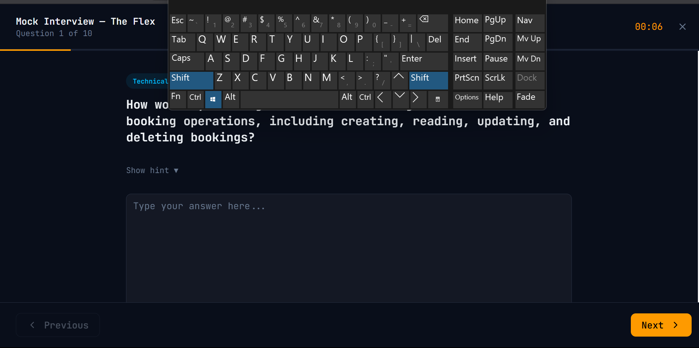

# ✈️ JobPilot — AI-Powered Job Search SaaS

> Land your dream job faster with AI. Adapt your CV, generate cover letters and prepare for interviews — all in one place. Bilingual FR/EN.

🔗 **Live:** [jobpilot-jet.vercel.app](https://jobpilot-jet.vercel.app)

---

## ✨ Features

### 📋 Job Tracker
- Kanban board with 5 stages: Applied → Phone Screen → Technical → Offer → Rejected
- Auto-parse job offers: company, role and salary extracted automatically
- Bilingual language detection (FR/EN) on every application
- Full application history with notes, salary and links

### 📄 Resume Adapter
- Upload your CV once as PDF
- Paste any job offer → AI adapts your CV to match the keywords and requirements
- Language auto-detected (FR/EN)
- Download adapted CV as PDF

### ✉️ Cover Letter Generator
- Personalized cover letter generated from your CV + job offer
- 3 paragraphs, professional tone, never generic
- Bilingual: FR or EN detected automatically
- Download as formatted PDF

### 🎤 Interview Prep
- 10 targeted questions generated per offer (5 technical + 5 behavioral)
- STAR method hints for each question
- Mock interview mode with live timer
- AI feedback on your answers: score, strengths, improvements (Pro)

### 💳 Stripe Payments
- Free tier: 5 applications, 3 CV adaptations, 3 cover letters/month
- Pro plan: $9/month — unlimited everything + AI feedback
- Stripe Customer Portal for subscription management

---

## 🛠️ Tech Stack

| Layer | Technology |
|---|---|
| Framework | Next.js 16 + TypeScript (App Router) |
| UI | Tailwind CSS + shadcn/ui |
| Font | JetBrains Mono |
| Auth | Clerk |
| Database | Supabase (PostgreSQL) + Prisma |
| File Storage | Supabase Storage |
| AI / LLM | Groq API (llama-3.3-70b-versatile) |
| Payments | Stripe |
| PDF | @react-pdf/renderer |
| Analytics | Vercel Analytics + Speed Insights |
| Deploy | Vercel |
| CI/CD | GitHub Actions |

---

## 🚀 Getting Started

### Prerequisites
- Node.js 20+
- npm
- A Supabase account
- A Clerk account
- A Groq API key
- A Stripe account

### Installation

```bash
# Clone the repo
git clone https://github.com/Gninho-silue/jobpilot.git
cd jobpilot

# Install dependencies
npm install

# Copy env file
cp .env.example .env.local
# Fill in your API keys (see Environment Variables below)

# Generate SQL from Prisma schema and run in Supabase SQL Editor
npx prisma migrate diff --from-empty --to-schema-datamodel prisma/schema.prisma --script

# Generate Prisma client
npx prisma generate

# Start development server
npm run dev
```

Open http://localhost:3000

---

## 🔐 Environment Variables

Create a `.env.local` file from `.env.example`:

```env
# Clerk
NEXT_PUBLIC_CLERK_PUBLISHABLE_KEY=
CLERK_SECRET_KEY=
NEXT_PUBLIC_CLERK_SIGN_IN_URL=/sign-in
NEXT_PUBLIC_CLERK_SIGN_UP_URL=/sign-up
NEXT_PUBLIC_CLERK_AFTER_SIGN_IN_URL=/dashboard
NEXT_PUBLIC_CLERK_AFTER_SIGN_UP_URL=/dashboard

# Database (Supabase)
DATABASE_URL=
DIRECT_URL=

# Supabase
NEXT_PUBLIC_SUPABASE_URL=
NEXT_PUBLIC_SUPABASE_ANON_KEY=
SUPABASE_SERVICE_ROLE_KEY=

# Groq
GROQ_API_KEY=

# Stripe
STRIPE_SECRET_KEY=
STRIPE_WEBHOOK_SECRET=
NEXT_PUBLIC_STRIPE_PUBLISHABLE_KEY=
STRIPE_PRO_PRICE_ID=

# App
NEXT_PUBLIC_APP_URL=http://localhost:3000
```

---

## 🗄️ Database Schema

Three main models:

- **User** — Clerk ID, plan (FREE/PRO), CV URL + extracted text, Stripe customer ID
- **Application** — company, role, status, language, offer text, adapted CV, cover letter, interview questions
- **UsageCounter** — monthly usage tracking per user (applications, CV adaptations, cover letters)

---

## 🔄 CI/CD

GitHub Actions runs on every push to `main` and `develop`:

1. **Lint** — ESLint
2. **Type check** — TypeScript strict mode
3. **Build** — Next.js production build
4. **Security scan** — `npm audit`

Vercel auto-deploys on push to `main`.

---

## 📁 Project Structure

```
jobpilot/
├── src/
│   ├── app/                    # Next.js App Router
│   │   ├── (app)/              # Protected routes (auth required)
│   │   │   ├── dashboard/
│   │   │   ├── applications/
│   │   │   ├── my-cv/
│   │   │   ├── interview-prep/
│   │   │   └── settings/
│   │   ├── api/                # API routes
│   │   │   ├── applications/
│   │   │   ├── cv/
│   │   │   ├── dashboard/
│   │   │   ├── stripe/
│   │   │   └── webhooks/
│   │   └── page.tsx            # Landing page
│   ├── components/             # UI components
│   ├── lib/                    # Clients + utilities
│   │   ├── ai/                 # All Groq prompt functions
│   │   ├── pdf/                # PDF generation
│   │   ├── prisma.ts
│   │   ├── stripe.ts
│   │   ├── groq.ts
│   │   ├── config.ts
│   │   └── analytics.ts
│   └── context/                # Claude Code context files
├── prisma/
│   └── schema.prisma
├── .github/
│   └── workflows/
│       ├── ci.yml
│       └── deploy.yml
├── .env.example
└── CLAUDE.md
```

---

## 📸 Screenshots

### Dashboard


### Kanban Board


### Resume Adapter


### Interview Prep


---

## 🚧 Roadmap

- [ ] Mobile app (React Native)
- [ ] Drag and drop Kanban
- [ ] Email reminders for follow-ups
- [ ] LinkedIn job import
- [ ] Team/agency plan
- [ ] AI feedback scoring history

---

## 👨‍💻 Author

**Gninninmaguignon Silué**
- GitHub: [@Gninho-silue](https://github.com/Gninho-silue)
- LinkedIn: [linkedin.com/in/gninema-silue](https://linkedin.com/in/gninema-silue)

---

## 📄 License

MIT
